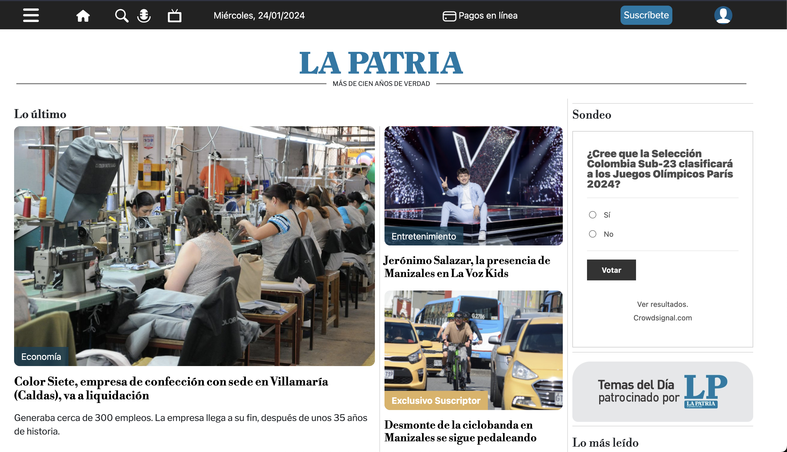
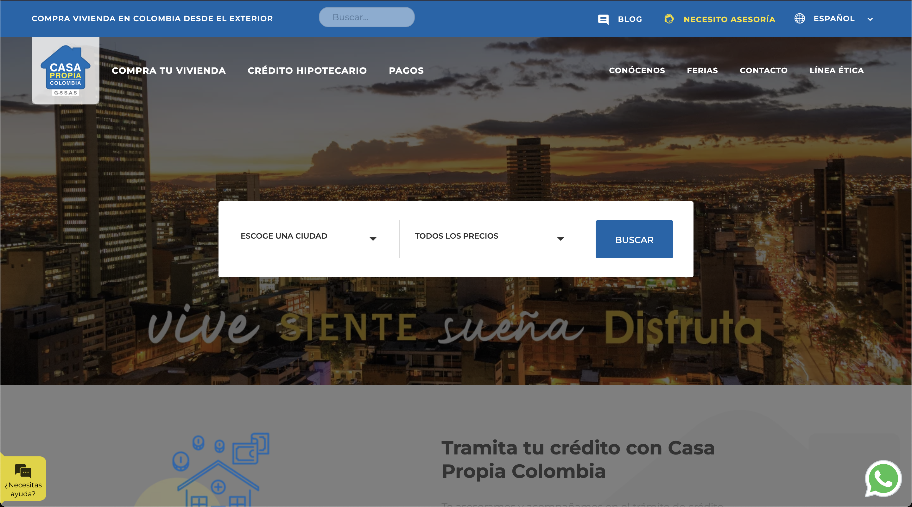
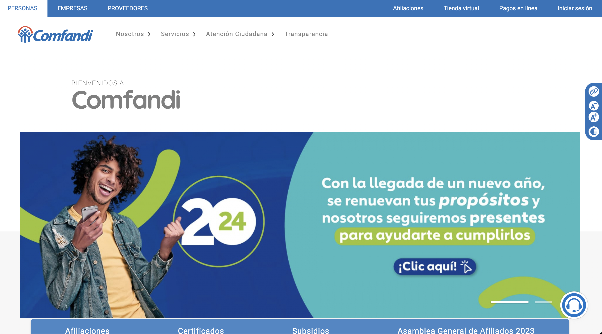
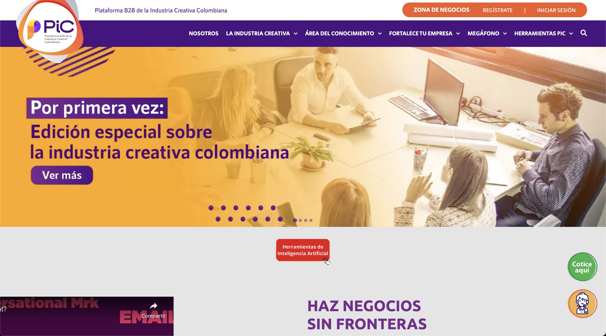

# Hola, mi nombre es Jorge Jimenez 👋

### Desarrollador Full Stack | Desarrollador Frontend | Full Stack Developer | Frontend Developer | React Software Engineer | Software Developer Engineer

<!--
**ingjorgejimenez/ingjorgejimenez** is a ✨ _special_ ✨ repository because its `README.md` (this file) appears on your GitHub profile.

Here are some ideas to get you started:

- 🔭 I’m currently working on ...
- 🌱 I’m currently learning ...
- 👯 I’m looking to collaborate on ...
- 🤔 I’m looking for help with ...
- 💬 Ask me about ...
- 📫 How to reach me: ...
- 😄 Pronouns: ...
- ⚡ Fun fact: ...
-->

Profesional en Ingeniería Electrónica de la Universidad Popular del Cesar poseo conocimientos en desarrollo de aplicaciones web. Usando diferentes tecnologías como: React, Redux, Next.js ,React Native,Html, Css, JavaScript, TypeScript, jQuery, Drupal, Bootstrap, Tailwind, Php con base de datos MySQL, MongoDB y una facilidad de aprendizaje para nuevas tecnologías.
Me considero una persona con destreza para trabajar bajo presión, emprendedora, proactiva, creativa, facilidad de adaptación a nuevos entornos con alto sentido de responsabilidad y compromiso cualidades que me permitirán desarrollar con eficiencia el cargo que me sea asignado.

## Tecnologías:

 
Y algunas más...

## Encuéntrame En ✨:

 

## Proyectos Realizados: ⚡

 

<table border="0" width="100%" cellpadding="0" cellspacing="0">
  <tr>
    <td valign="top" align="center">  
      <a href="https://urosario.edu.co" target="_blank">   
        <h4 align="center">Universidad del Rosario</h4>
      </a>
      
    </td>
    <td valign="top" align="center">  
      <a  href="https://www.lapatria.com" target="_blank">    
        <h4 align="center">La Patria</h4>
      </a>
      
    </td>
    <td valign="top" align="center">  
      <a href="https://casapropiacolombia.com/es" target="_blank">     
        <h4 align="center">Casa Propia</h4>
      </a>
      
    </td>
    <td valign="top" align="center"> 
      <a href="https://www.comfandi.com.co/" target="_blank">   
        <h4 align="center">Comfandi</h4> 
      </a>
      
    </td>
  </tr>
   <tr>
    <td valign="top" align="center">   
        <a href="https://ingjorgejimenez.github.io/Movies/" target="_blank">
          <h4 align="center">Website React</h4>
        </a>
        
    </td>
    <td valign="top" align="center">   
      <a href="https://piccolombia.com/" target="_blank">
        <h4 align="center">Pic Colombia</h4>
      </a>
      
    </td>
   </tr>
</table>
<h3>Avanza para seguir viendo mis proyectos públicos: ↆ ...¡Gracias!</h3>
